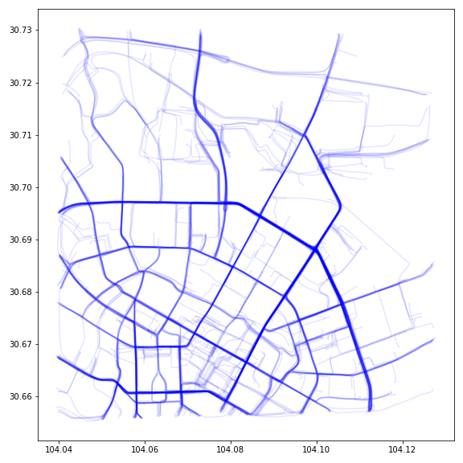

#### Requirements
You can install the required packages in your python environment by:

      python>=3.7
      torch>=1.7
      pandas
      numpy
      matplotlib
      pathlib
      shutil
      datetime
      colored
      math


#### Train the trajectory generation model

1. Download the data with permission of using your own GPS trajectory data

2. Change the corresponding paths in the config.py and main.py files

3. Run and train the model by:

   ```bash
   python main.py 
   ```

4. The code will save the trained model every 10 epoches

#### Usage for Trajectory Generation

Refer to Traj_Generation.ipynb file, we provide the fine-trained model (model.pt) simple guide infromation(heads.npy) example to explain how to generate trajectories.

#### Generated result


